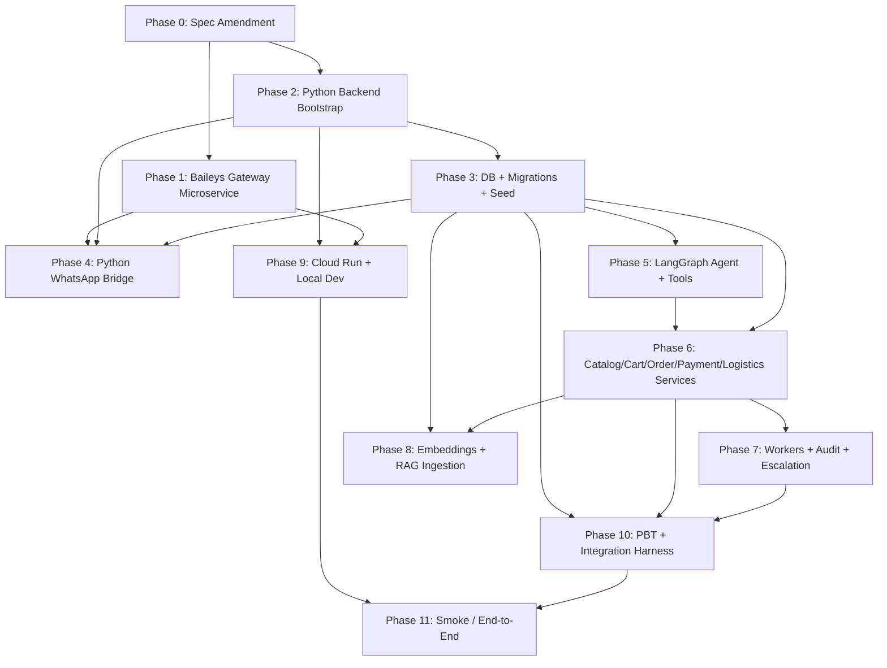

# Implementation Plan

## Overview

This plan delivers the WhatsApp Sales Agent MVP end-to-end, with the WhatsApp transport built on the Baileys library (Node.js + WhatsApp Web) instead of the Meta Cloud API assumed by the original spec. Phase 0 amends the requirements and design to encode the pivot. Phase 1 builds the standalone Baileys gateway microservice (the user-prioritized first focus). Phases 2 through 9 build out the Python FastAPI backend, LangGraph agent, services, workers, embeddings, and Cloud Run readiness. Phases 10 and 11 deliver the test harness, property-based tests for every design correctness property, and the end-to-end smoke validation.

## Architecture Pivot Note

The user has chosen to pivot the WhatsApp transport from the Meta WhatsApp Cloud API (assumed by the original requirements.md and design.md) to **Baileys** ([@whiskeysockets/baileys](https://github.com/WhiskeySockets/Baileys)), a Node.js/TypeScript library that connects to WhatsApp Web via WebSocket using QR-code pairing.

Implications:

- The Meta-specific concepts in the current spec are no longer applicable: `WHATSAPP_APP_SECRET` HMAC validation, `WHATSAPP_VERIFY_TOKEN`, `hub.verify_token` handshake, `WHATSAPP_PHONE_NUMBER_ID`, `WHATSAPP_ACCESS_TOKEN`, and the Meta-style `GET/POST /webhooks/whatsapp` endpoints.
- A new top-level component is introduced: a **WhatsApp Gateway microservice** (Node.js + Baileys) that owns the WhatsApp session, handles QR pairing, persists auth state to disk, and exposes an authenticated internal HTTP contract to the Python backend.
- The Python backend exposes `POST /internal/whatsapp/inbound` (bearer-token authenticated) for the gateway to forward inbound messages, and calls the gateway's `POST /send` for outbound replies.
- The non-WhatsApp parts of the spec (Requirements 2 through 13) are unaffected and remain authoritative.

Phase 0 of this plan amends requirements.md and design.md to encode this pivot; all subsequent work depends on Phase 0 being complete.

## Task Dependency Graph



```json
{
  "waves": [
    { "wave": 0, "tasks": ["0.1", "0.2", "0.3"] },
    { "wave": 1, "tasks": ["1.1", "2.1"] },
    { "wave": 2, "tasks": ["1.2", "2.2", "2.3"] },
    { "wave": 3, "tasks": ["1.3", "1.8", "1.11", "2.4", "2.5", "3.1", "3.6"] },
    { "wave": 4, "tasks": ["1.4", "1.5", "1.6", "1.7", "2.6", "3.2", "5.1", "5.2", "6.4", "6.6", "8.1", "9.1"] },
    { "wave": 5, "tasks": ["1.9", "1.10", "3.3", "5.3", "9.3"] },
    { "wave": 6, "tasks": ["1.12", "1.13", "1.14", "3.4", "8.2"] },
    { "wave": 7, "tasks": ["1.15", "3.5", "6.1", "6.2", "6.3", "6.7", "6.9", "7.1", "7.3", "8.3", "10.1", "10.2", "10.3"] },
    { "wave": 8, "tasks": ["5.4", "5.5", "6.5", "6.8", "7.2", "7.5", "7.6"] },
    { "wave": 9, "tasks": ["4.1", "4.4", "5.6", "6.10", "7.4", "9.2", "9.5", "10.4"] },
    { "wave": 10, "tasks": ["4.2", "4.3", "9.4", "10.5"] },
    { "wave": 11, "tasks": ["4.5", "10.6", "11.1"] },
    { "wave": 12, "tasks": ["11.2", "11.3"] }
  ]
}
```

> Phase 0 must complete before any implementation work begins outside Phase 1. Phase 1 (the Baileys gateway) is the user-prioritized first focus and depends only on the spec amendments in Phase 0.

## Tasks

### Phase 0: Spec Amendment for Baileys Pivot

- [x] 0.1 Amend requirements.md — Requirement 1 (WhatsApp transport)
  - Replace acceptance criteria 1.1–1.12 with Baileys-aligned criteria covering: a Baileys gateway as a separate component, QR-code pairing flow, persisted auth state across restarts, authenticated internal channel between gateway and Python backend, inbound message dedupe by Baileys message id, outbound send semantics with the same 10s timeout and 1/2/4s retry budget, status update propagation, non-text reply policy, and graceful reconnection on socket loss.
  - Replace Meta env vars in the Glossary and AC text with Baileys-relevant ones: `WHATSAPP_GATEWAY_URL`, `WHATSAPP_GATEWAY_INTERNAL_TOKEN`, `WHATSAPP_GATEWAY_AUTH_DIR`, `WHATSAPP_BACKEND_INBOUND_URL`.
  - Update the Glossary entries `WhatsApp_Provider` and `WhatsApp_Webhook_Verifier` to reflect the gateway architecture; add a new term `WhatsApp_Gateway`.
  - Requirements: post-amendment Req 1
  - Design: amended Webhook Handling Subsystem section
  - Depends on: none
  - Verification: getDiagnostics on requirements.md returns no errors; the file no longer contains references to `WHATSAPP_APP_SECRET`, `WHATSAPP_VERIFY_TOKEN`, `WHATSAPP_PHONE_NUMBER_ID`, or `WHATSAPP_ACCESS_TOKEN`.

- [-] 0.2 Amend design.md — architecture, sequence diagrams, settings, structure
  - In the high-level architecture diagram, replace `WhatsApp Cloud API` with `WhatsApp Gateway (Node.js + Baileys)` and add the gateway as an external-process component reached over an internal HTTP channel.
  - Update the inbound and outbound sequence diagrams to route through the gateway; replace the HMAC verification step with bearer-token verification on `POST /internal/whatsapp/inbound`.
  - Replace the Settings (`app/config.py`) WhatsApp env vars with the Baileys gateway vars; update `.env.example` accordingly.
  - Add `whatsapp_gateway/` as a new top-level directory in the project structure.
  - Update the Error Handling table: remove the WhatsApp Cloud API row and replace with two rows for the Baileys gateway (`POST /send`) and the inbound forwarder (`POST /internal/whatsapp/inbound`).
  - Update the Requirements Traceability Matrix entry for Req 1.
  - Requirements: post-amendment Req 1
  - Design: Architecture, Webhook Handling Subsystem, Configuration and Deployment, Project Structure, Error Handling
  - Depends on: 0.1
  - Verification: getDiagnostics on design.md returns no errors; the high-level mermaid diagram includes a `WhatsApp Gateway` node; the `.env.example` snippet lists `WHATSAPP_GATEWAY_URL` and `WHATSAPP_GATEWAY_INTERNAL_TOKEN`.

- [~] 0.3 Validate amended docs and update the design correctness properties touching WhatsApp
  - Re-read Properties 1, 2, 3 in the design.md Correctness Properties section and rewrite them to refer to the gateway-based authentication and idempotency keys (Baileys message id remains the inbound dedupe key; the gateway internal bearer token replaces HMAC).
  - Requirements: post-amendment Req 1
  - Design: Correctness Properties section
  - Depends on: 0.2
  - Verification: getDiagnostics passes; Properties 1–3 reference the gateway and bearer auth, not HMAC.

### Phase 1: WhatsApp Gateway Microservice (Node.js + Baileys) — User Priority

- [ ] 1.1 Initialize the gateway project under `whatsapp_gateway/`
  - `package.json` with TypeScript, ESLint, Prettier; `tsconfig.json` (target ES2022, module NodeNext); `pnpm` or `npm` lockfile committed.
  - Add scripts: `dev` (tsx watch), `build` (tsc), `start` (node dist/index.js), `lint`, `test`.
  - Requirements: post-amendment Req 1
  - Design: Project Structure (new `whatsapp_gateway/` top-level directory)
  - Depends on: 0.2
  - Verification: `pnpm install && pnpm build` succeeds; `pnpm lint` reports no errors on the empty skeleton.

- [ ] 1.2 Add Baileys and supporting dependencies
  - Runtime: `@whiskeysockets/baileys`, `fastify` (or `express`), `pino`, `pino-pretty` (dev), `zod`, `dotenv`, `axios`, `qrcode`.
  - Dev: `@types/node`, `typescript`, `tsx`, `eslint`, `prettier`, `vitest`, `@types/qrcode`.
  - Requirements: post-amendment Req 1
  - Design: Components and Interfaces — WhatsApp Gateway
  - Depends on: 1.1
  - Verification: `pnpm install` succeeds; lockfile pins exact Baileys version.

- [ ] 1.3 Implement Baileys session bootstrap
  - File: `src/baileys/session.ts`. Use `useMultiFileAuthState(WHATSAPP_GATEWAY_AUTH_DIR)` for persisted auth.
  - Create the Baileys socket; subscribe to `connection.update` events; handle `lastDisconnect.error?.output?.statusCode` to determine whether to reconnect (and not on `loggedOut`).
  - Expose a `SessionManager` singleton with `getSocket()`, `isConnected()`, and `currentQR()`.
  - Requirements: post-amendment Req 1 (session persistence, reconnection)
  - Design: Components and Interfaces — WhatsApp Gateway
  - Depends on: 1.2
  - Verification: unit test using a fake transport asserts `SessionManager` recreates its socket after a simulated disconnect that is not `loggedOut`, and exits cleanly when `loggedOut` is observed.

- [ ] 1.4 Implement `GET /qr` endpoint
  - Returns the latest QR code as a JSON `{ "qr_data_url": "data:image/png;base64,..." }` when paired pending, or `{ "status": "connected" }` when paired.
  - Gated by `WHATSAPP_GATEWAY_INTERNAL_TOKEN` bearer auth.
  - Requirements: post-amendment Req 1 (QR pairing)
  - Design: Components and Interfaces — WhatsApp Gateway
  - Depends on: 1.3
  - Verification: integration test with a fake session returns 200 with a non-empty `qr_data_url` when the session is in QR-pending state, and 401 when the bearer token is missing/wrong.

- [ ] 1.5 Implement `messages.upsert` event handler
  - File: `src/baileys/inbound.ts`. Subscribe to `sock.ev.on("messages.upsert", handler)`.
  - For each message: filter `key.fromMe === false`; extract Baileys message id (`key.id`), JID, normalize to E.164 (`src/utils/phone.ts`), classify message type (text vs media vs status), build an `InboundEvent` Zod-validated payload.
  - Dedupe by `(key.remoteJid, key.id)` in a small bounded LRU to absorb intra-process retries.
  - Hand off to the inbound forwarder (Task 1.9).
  - Requirements: post-amendment Req 1 (inbound dedupe by Baileys message id), Req 2.1–2.2 (E.164 normalization)
  - Design: Components and Interfaces — WhatsApp Gateway, Property 2
  - Depends on: 1.3
  - Verification: unit test feeds two upsert events with the same `(remoteJid, id)` and asserts only one `InboundEvent` is forwarded.

- [ ] 1.6 Implement `POST /send` endpoint
  - Body: `{ to: string (E.164), body: string, idempotency_key: string }` (zod-validated).
  - Calls `sock.sendMessage(jid, { text: body })` with a 10s timeout (axios/abort-controller pattern around the Baileys promise).
  - Returns 200 `{ status: "sent", message_id }` on success, 504 `{ status: "timeout" }` on timeout, 503 `{ status: "not_connected" }` if Baileys socket is not connected, 502 `{ status: "send_failed", error_code }` on Baileys errors.
  - Idempotency key cached in a bounded LRU; replays of the same key within TTL return the cached response.
  - Requirements: post-amendment Req 1 (outbound send + 10s timeout)
  - Design: Components and Interfaces — WhatsApp Gateway, Property 3
  - Depends on: 1.3, 1.8
  - Verification: integration test asserts (a) successful send returns 200 with a `message_id`, (b) duplicate idempotency_key replays return the same response, (c) socket-disconnected state returns 503.

- [ ] 1.7 Implement `GET /healthz` and `GET /readyz`
  - `/healthz`: returns 200 immediately, no dependency checks.
  - `/readyz`: returns 200 only when `SessionManager.isConnected()` is true; otherwise 503 with `{ "status": "not_connected" }`.
  - Requirements: post-amendment Req 1 (gateway health), Req 12.6, 12.7
  - Design: Components and Interfaces — WhatsApp Gateway, Configuration and Deployment
  - Depends on: 1.3
  - Verification: integration tests cover both connected and disconnected states.

- [ ] 1.8 Implement internal authentication middleware
  - Bearer-token middleware that verifies `Authorization: Bearer <WHATSAPP_GATEWAY_INTERNAL_TOKEN>` on `POST /send` and on `GET /qr`. Constant-time string comparison.
  - The inbound forwarder (Task 1.9) attaches the same bearer token when calling the Python backend.
  - Requirements: post-amendment Req 1 (internal auth replaces Meta HMAC)
  - Design: Webhook Handling Subsystem (post-amendment), Property 1
  - Depends on: 1.2
  - Verification: 401 returned when token is missing/incorrect; 200 when correct; constant-time comparison verified by a unit test on `safeCompare()`.

- [ ] 1.9 Implement inbound forwarder with retries and overflow queue
  - File: `src/forwarder/forwarder.ts`. POSTs each `InboundEvent` to `WHATSAPP_BACKEND_INBOUND_URL` with `Authorization: Bearer <WHATSAPP_GATEWAY_INTERNAL_TOKEN>` and 10s timeout.
  - Retry policy: 1s/2s/4s, capped 8s, max 3 attempts.
  - On exhausted retries, persist to an on-disk overflow queue (newline-delimited JSON in `WHATSAPP_GATEWAY_AUTH_DIR/outbox/`); a background scanner re-attempts overflow events every 30s while the backend is reachable.
  - Requirements: post-amendment Req 1 (no inbound message lost), Req 2.3 (conversation creation pre-agent)
  - Design: Components and Interfaces — WhatsApp Gateway, Error Handling
  - Depends on: 1.5, 1.8
  - Verification: integration test simulates backend 500 for 3 attempts and asserts the event is written to the overflow queue and re-attempted on backend recovery.

- [ ] 1.10 Implement structured logging and a small metrics endpoint
  - pino JSON logging with request id correlation; log fields include `event_id`, `gateway_action`, `to_phone`, `status`.
  - `GET /metrics` exposes counters: inbound forwarded, inbound failed, outbound sent, outbound failed, queue depth.
  - Requirements: Req 11 (auditability of operational events on the gateway side)
  - Design: Observability Layer
  - Depends on: 1.5, 1.6, 1.9
  - Verification: a smoke run exposes non-zero counters after one successful send and one inbound forward.

- [ ] 1.11 Multi-stage Dockerfile for the gateway
  - Node 20 alpine, two stages (deps build vs runtime), runs as non-root, exposes `PORT` (default 3001), volume mount point for `/data/auth_state`.
  - Requirements: post-amendment Req 1
  - Design: Configuration and Deployment
  - Depends on: 1.1
  - Verification: `docker build whatsapp_gateway/` succeeds; the built image starts and `/healthz` answers within 30s.

- [ ] 1.12 docker-compose.yml entry for the gateway
  - Service `whatsapp_gateway` with `WHATSAPP_GATEWAY_AUTH_DIR=/data/auth_state`, named volume `wa_gateway_state:/data/auth_state` for session persistence across restarts; exposes port 3001 to the api service network.
  - Requirements: post-amendment Req 1, Req 13.6 (local dev)
  - Design: Configuration and Deployment
  - Depends on: 1.11
  - Verification: `docker compose up -d whatsapp_gateway` brings the container to healthy status; restarting the container preserves the auth_state volume.

- [ ] 1.13 Unit tests for the gateway
  - `src/utils/phone.spec.ts`: idempotence and invalid-rejection (mirrors Property 4).
  - `src/baileys/inbound.spec.ts`: dedupe by `(remoteJid, id)`.
  - `src/forwarder/forwarder.spec.ts`: retry/backoff, overflow on exhaustion.
  - `src/middleware/auth.spec.ts`: bearer-token verification with constant-time comparison.
  - Requirements: post-amendment Req 1
  - Design: Properties 1, 2, 3, 4
  - Depends on: 1.5, 1.6, 1.8, 1.9
  - Verification: `pnpm test` passes locally and in CI; coverage on these files ≥ 90%.

- [ ] 1.14 Integration test against a Baileys mock
  - Use a `FakeBaileysSocket` (in-memory event emitter implementing the Baileys interfaces used by `SessionManager` and `inbound.ts`).
  - Scenarios: (a) inbound text message → forwarded to a fake backend HTTP server, (b) outbound `POST /send` → `FakeBaileysSocket.sendMessage` invoked once, (c) backend down → overflow queue, (d) socket reconnect cycle.
  - Requirements: post-amendment Req 1
  - Design: Properties 1, 2, 3
  - Depends on: 1.5, 1.6, 1.9
  - Verification: `pnpm test:integration` runs the full scenario suite; CI does not require a real WhatsApp connection.

- [ ] 1.15 Gateway README
  - `whatsapp_gateway/README.md`: prerequisites, install, env vars, how to scan QR (`curl /qr` with bearer token, render the data URL), how to run via docker compose, how to back up auth_state, how to log out and re-pair.
  - Requirements: post-amendment Req 1, Req 13.7
  - Design: Local Development with uv (cross-references)
  - Depends on: 1.4, 1.11, 1.12
  - Verification: a developer following the README from a clean checkout reaches a paired session and a working `/healthz=200, /readyz=200`.

### Phase 2: Python Backend Bootstrap

- [ ] 2.1 Initialize Python project with uv
  - `pyproject.toml` (Python `>=3.11`), runtime and dev dependency groups as listed in design.md (FastAPI, uvicorn, pydantic, pydantic-settings, SQLAlchemy[asyncio], asyncpg, alembic, pgvector, httpx, phonenumbers, structlog, langchain, langgraph, langgraph-checkpoint-postgres, langchain-openai, langchain-anthropic, langchain-google-genai, tenacity, python-multipart; dev: pytest, pytest-asyncio, pytest-cov, hypothesis, ruff, mypy, respx, testcontainers[postgres]).
  - Generate `uv.lock` via `uv sync`.
  - Requirements: Req 13.1, 13.2, 13.3
  - Design: Local Development with uv
  - Depends on: 0.2
  - Verification: `uv sync --frozen` exits 0 on a clean checkout in under 600s.

- [ ] 2.2 Create the directory layout per steering/structure.md
  - `app/api`, `app/agent` (with `nodes/`, `prompts/`), `app/tools`, `app/services`, `app/repositories`, `app/db` (with `migrations/`), `app/vectorstore`, `app/workers`, `app/schemas`, `app/observability`, `app/utils`, `mcp_servers/`, `tests/{unit,properties,integration,smoke}`, `scripts/`, `docs/`, `infra/`. Each package has an `__init__.py`.
  - Requirements: Req 13.7
  - Design: Project Structure
  - Depends on: 2.1
  - Verification: `tree -L 2 app` matches the structure in design.md.

- [ ] 2.3 Implement `app/config.py` with Pydantic Settings and fail-fast validation
  - All env vars from the amended design.md, including `WHATSAPP_GATEWAY_URL`, `WHATSAPP_GATEWAY_INTERNAL_TOKEN`, `WHATSAPP_BACKEND_INBOUND_URL` (used by gateway, surfaced for documentation), `LLM_PROVIDER`, `LLM_MODEL`, provider credentials, `DATABASE_URL`, `PORT`, `PAYMENT_*`, `RAG_*`, `ESCALATION_CONFIDENCE_THRESHOLD`, `EMBEDDING_MODEL`.
  - `model_validator(mode="after")` raises `StartupConfigError` when (a) `LLM_PROVIDER` is invalid, (b) the matching credential is missing/empty, (c) `LLM_MODEL` is empty, (d) `PORT` is out of range, or (e) the gateway URL is missing.
  - Requirements: Req 12.1, 12.2, 12.3, 12.4, 12.10, 12.11
  - Design: Configuration and Deployment, Property 28
  - Depends on: 2.2
  - Verification: unit tests cover each invalid-config branch; the app exits non-zero before binding any port when invalid.

- [ ] 2.4 Implement `app/main.py` FastAPI app factory
  - Lifespan that: validates `Settings`, initializes the DB engine + session factory, initializes the LangGraph PostgresSaver, starts in-process workers, and on shutdown drains them with a 10s budget.
  - Wires all routers; sets up structured logging middleware that injects `request_id` into context.
  - Requirements: Req 12.6, 12.7, 12.9, 12.10, 13.9
  - Design: Configuration and Deployment, Worker Layer
  - Depends on: 2.3
  - Verification: `uv run uvicorn app.main:app --port 8080` starts within 30s and answers `/healthz` with 200 in under 1s.

- [ ] 2.5 Observability scaffolding
  - `app/observability/logging.py` (structlog with JSON renderer, request-id binder, redaction processor), `tracing.py` (OpenTelemetry FastAPI/asyncpg/httpx instrumentation, OTLP exporter via env), `metrics.py` (Prometheus-style counters; expose `/metrics` later if desired).
  - Requirements: Req 11.8 (redaction)
  - Design: Observability Layer, Property 26
  - Depends on: 2.2
  - Verification: log lines from a unit-tested handler include `request_id`, `conversation_id` when set, and never contain credential-like substrings.

- [ ] 2.6 Implement `/healthz` and `/readyz`
  - `app/api/health.py`. `/healthz` returns `{status:"ok", ts:...}` in under 1s with no DB I/O. `/readyz` runs a `SELECT 1` and a checkpointer reachability probe with `asyncio.wait_for`; returns 503 with `{status:"not_ready", dependency:"db"|"checkpointer"}` on failure.
  - Requirements: Req 12.6, 12.7, 12.8
  - Design: Configuration and Deployment, Property 29
  - Depends on: 2.4
  - Verification: integration test with the DB stopped returns 503 and identifies `db` as the missing dependency; healthy state returns 200.

### Phase 3: Database, Migrations, Seed

- [ ] 3.1 SQLAlchemy 2.0 async engine and session factory
  - `app/db/session.py`: `create_async_engine(DATABASE_URL, pool_pre_ping=True)`, `async_sessionmaker(expire_on_commit=False)`, request-scoped `get_session` dependency.
  - Requirements: Req 13.7
  - Design: Repositories Layer
  - Depends on: 2.4
  - Verification: a unit test obtains a session and runs `SELECT 1`.

- [ ] 3.2 SQLAlchemy models for all design tables
  - `app/db/models.py`: `customers`, `conversations`, `messages_inbound`, `messages_outbound`, `products`, `product_variants`, `product_embeddings`, `faq_documents`, `faq_embeddings`, `carts`, `cart_items`, `orders`, `order_items`, `payments`, `payment_webhook_events`, `shipments`, `dispatched_actions`, `audit_logs`, `audit_log_failures`, `escalations`, `admin_users`. Constraints, indexes, partial unique indexes (active OPEN cart per customer), and CHECKs as in the design.
  - Requirements: Reqs 1, 2, 3, 5, 6, 7, 8, 9, 10, 11
  - Design: Data Models
  - Depends on: 3.1
  - Verification: `mypy` passes; `Base.metadata` reflects the expected DDL; round-trip insert/select on each model in unit tests.

- [ ] 3.3 Alembic setup and initial migration
  - `app/db/migrations/` with `env.py` configured for async, `alembic.ini` at repo root, initial migration `0001_init.py` that runs `CREATE EXTENSION IF NOT EXISTS vector`, creates all tables, adds CHECKs, partial unique indexes, pgvector indexes (HNSW or IVFFlat) on `product_embeddings.embedding` and `faq_embeddings.embedding`.
  - Requirements: Req 12.13, Req 13.6
  - Design: Data Models
  - Depends on: 3.2
  - Verification: `uv run alembic upgrade head` against a fresh `pgvector/pgvector:pg16` container completes without errors; `uv run alembic downgrade -1 && upgrade head` is idempotent.

- [ ] 3.4 Repositories (narrow async functions; services own transactions)
  - One module per primary aggregate in `app/repositories/`. Examples: `customers.upsert(phone_e164)`, `messages.insert_inbound_idempotent(...)`, `webhook_events.try_insert(webhook_event_id, payment_id, raw_payload)`, `dispatched_actions.try_dispatch(order_id, action_type)`. Repositories accept an `AsyncSession` or `AsyncConnection` argument and never `commit()`.
  - Requirements: Reqs 1, 5, 6, 7, 8, 9, 10, 11
  - Design: Repositories Layer
  - Depends on: 3.2
  - Verification: each repo function has at least one unit test with a transactional rollback fixture.

- [ ] 3.5 `scripts/migrate_and_seed.py`
  - Steps: (a) `alembic upgrade head`; (b) ensure pgvector extension; (c) seed ≥5 products with ≥1 variant each (idempotent via `INSERT ... ON CONFLICT (variant_sku) DO NOTHING`); (d) seed ≥5 FAQ documents (idempotent); (e) compute and upsert embeddings for any product/FAQ row updated since last run (Phase 8 wires the embedding generator).
  - Idempotent: a second run produces no new rows and is detectable from row counts.
  - Requirements: Req 13.5, 13.6, 13.7, 13.8
  - Design: Local Development with uv
  - Depends on: 3.3, 3.4, 8.2
  - Verification: running the script twice yields identical `SELECT count(*)` from `products` and `faq_documents`; failure modes (DB unreachable, mid-step error) cause non-zero exit with descriptive log line.

- [ ] 3.6 docker-compose entry for `pgvector/pgvector:pg16`
  - Service `postgres` with healthcheck (`pg_isready`), named volume `pgdata`, exposed on `5432`.
  - Requirements: Req 12.13, Req 13.6
  - Design: Configuration and Deployment
  - Depends on: 0.2
  - Verification: `docker compose up -d postgres` reaches healthy state within 30s; pgvector extension is loadable from a psql session.


### Phase 4: Internal WhatsApp Bridge (Python side)

- [ ] 4.1 Pydantic schemas for the internal gateway contract
  - `app/schemas/whatsapp.py`: `InboundEvent` (Baileys message id, sender phone E.164, message type, text body or media stub, event timestamp, raw payload), `OutboundSendRequest`, `OutboundSendResponse`.
  - Requirements: post-amendment Req 1
  - Design: Webhook Handling Subsystem (post-amendment)
  - Depends on: 0.2
  - Verification: round-trip unit tests for Zod-equivalent validation; reject unknown fields and out-of-range timestamps.

- [ ] 4.2 `POST /internal/whatsapp/inbound` endpoint
  - `app/api/whatsapp.py`: bearer-auth middleware verifying `WHATSAPP_GATEWAY_INTERNAL_TOKEN` (constant-time compare); body size cap 1 MB; parses to `InboundEvent`; idempotent insert into `messages_inbound` keyed by Baileys message id; on conflict returns 200 with `{status:"duplicate"}`; otherwise upserts customer (E.164 normalize), upserts conversation, enqueues `agent_turn` task with dedupe key `agent:{baileys_message_id}`; status updates route to `repositories/messages.update_outbound_status`; non-text messages enqueue a `non_text_reply` task; returns 200 within 5s.
  - Requirements: post-amendment Req 1, Req 2.1, 2.2, 2.3
  - Design: Webhook Handling Subsystem (post-amendment), Properties 1, 2, 4
  - Depends on: 2.6, 3.4, 4.1, 7.1
  - Verification: integration tests cover happy path (inserts inbound + enqueues task), duplicate (no second insert, no second enqueue), invalid bearer (401), invalid phone (audit + skip), and non-text message branches.

- [ ] 4.3 Outbound sender worker (`app/workers/whatsapp_sender.py`)
  - Consumes `whatsapp_send` tasks from the in-process queue; calls `POST {WHATSAPP_GATEWAY_URL}/send` with bearer auth, 10s timeout per attempt, retry budget 1s/2s/4s capped 8s, max 3 attempts; chunking for bodies over 4096 chars; updates `messages_outbound.status` and `attempts`; on terminal failure persists `failed` status and emits an audit record `outbound_send_failure`.
  - Requirements: post-amendment Req 1
  - Design: Webhook Handling Subsystem (post-amendment), Property 3
  - Depends on: 4.1, 7.1, 7.3
  - Verification: integration test with a stubbed gateway server asserts (a) one send returns `sent`, (b) a server returning 500 thrice ends in `failed` with attempts=3 and an audit row.

- [ ] 4.4 Phone normalization utility
  - `app/utils/phone.py::normalize_to_e164(raw)` using the `phonenumbers` library; returns `None` on invalid; idempotent for valid inputs.
  - Requirements: Req 2.1, 2.2
  - Design: Utilities Layer, Property 4
  - Depends on: 2.2
  - Verification: Hypothesis property test asserts idempotence and the rejection-on-invalid invariant.

- [ ] 4.5 Property tests for the bridge
  - `tests/properties/test_p01_internal_inbound_auth_gate.py` (Property 1, post-amendment: bearer-token gating produces no DB writes on bad token).
  - `tests/properties/test_p02_inbound_idempotency.py` (Property 2: replays of the same Baileys message id yield exactly one inbound row and one enqueued task).
  - `tests/properties/test_p03_outbound_retry_policy.py` (Property 3: backoff sequence and bounded attempts).
  - `tests/properties/test_p04_phone_normalization.py` (Property 4).
  - Requirements: Reqs 1, 2.1, 2.2
  - Design: Properties 1–4
  - Depends on: 4.2, 4.3, 4.4
  - Verification: `uv run pytest tests/properties -q` passes for these properties.

### Phase 5: LangGraph Agent and Tools

- [ ] 5.1 LLM_Factory
  - `app/agent/llm_factory.py`: `build_llm_factory(settings)` returns a singleton factory exposing `get_chat_model(temperature, max_tokens)`. Provider selection on `settings.LLM_PROVIDER`. Validates the matching credential env var.
  - AST/lint rule (`scripts/check_no_provider_imports.py`) ensures `app/agent/**` does not import `langchain_openai|langchain_anthropic|langchain_google_genai` directly.
  - Requirements: Req 12.1, 12.2, 12.3, 12.4, 12.5
  - Design: Components and Interfaces — Agent Layer, Property 28
  - Depends on: 2.3
  - Verification: unit test exercises each provider branch; a separate test runs the AST check and asserts a clean tree.

- [ ] 5.2 ConversationState TypedDict
  - `app/agent/state.py` matching the design (identity fields, message thread reducer, intent + confidence, RAG snippets, working refs, escalation tracking, tool_errors, reply_text/reply_enqueued).
  - Requirements: Req 2, Req 10
  - Design: ConversationState TypedDict
  - Depends on: 2.2
  - Verification: type check passes; serializing the empty state to JSON for checkpointing succeeds.

- [ ] 5.3 PostgresSaver checkpointer wiring
  - `app/agent/checkpointer.py`: build `PostgresSaver` over the same async connection pool. `thread_id` derived from `conversation_id`. Wrap load/commit calls with 5s timeouts; on failure, set the escalation flag transactionally before any audit write, and surface a non-success response to the inbound handler.
  - Requirements: Req 2.3, 2.4, 2.5, 2.6, 2.7, 2.8, 2.9, 2.10
  - Design: Components and Interfaces — Agent Layer, Properties 5, 6
  - Depends on: 3.3, 5.2
  - Verification: integration test simulates a checkpoint load failure and asserts the escalation flag is set, the audit record is written after, and no outbound reply is enqueued.

- [ ] 5.4 LangGraph nodes
  - `app/agent/nodes/`: `route_intent.py` (LLM with structured-output classifier producing `intent` + `intent_confidence`), `retrieve_rag.py`, `search_catalog.py`, `recommend.py`, `manage_cart.py`, `request_confirmation.py` (computes `customer_confirmation_token`), `create_order.py`, `create_payment_link.py`, `escalate.py`, `send_reply.py` (enqueues `whatsapp_send`, never blocks on outbound IO).
  - Edge logic: 2 consecutive RAG misses or 2 consecutive catalog tool failures route to `escalate`; confidence below `ESCALATION_CONFIDENCE_THRESHOLD` routes to `escalate` with the candidate reply suppressed.
  - Requirements: Reqs 3, 4, 5, 6, 7, 10
  - Design: LangGraph Agent Design, Properties 7, 8, 24
  - Depends on: 5.3, 6.1, 6.5, 6.7
  - Verification: unit tests with FakeChatModel exercise each branching condition and assert the resulting `ConversationState`.

- [ ] 5.5 Tool definitions
  - `app/tools/catalog.py`: `search_products`, `add_to_cart`, `update_cart_item_quantity`, `remove_from_cart`, `get_cart`. Pydantic input/output schemas; uniform `ToolResult` envelope; per-tool `asyncio.wait_for` timeout per design.
  - `app/tools/order.py::create_order`, `app/tools/payment.py::create_payment_link`, `app/tools/support.py::escalate_to_human`.
  - `prepare_shipment` is intentionally NOT a LangChain tool.
  - Each successful or failed tool invocation emits exactly one audit record via `AuditLogger.emit` keyed by a tool-invocation id.
  - Requirements: Reqs 3, 4, 5, 6, 7, 10, 11
  - Design: Components and Interfaces — Tools Layer, Properties 9, 13, 25
  - Depends on: 6.1, 6.5, 6.7, 7.3
  - Verification: schema-validation unit tests reject malformed inputs without contacting any service; an audit-exactly-once unit test checks one record per call.

- [ ] 5.6 Property tests for the agent
  - `tests/properties/test_p07_rag_bounds.py` (Property 7, RAG_TOP_K and threshold honoured), `test_p08_consecutive_failure_escalation.py` (Property 8), `test_p24_escalation_suppresses_replies.py` (Property 24).
  - Requirements: Reqs 3, 8, 10
  - Design: Properties 7, 8, 24
  - Depends on: 5.4, 7.5
  - Verification: `uv run pytest tests/properties -q` passes for these properties.

### Phase 6: Catalog, Cart, Order, Payment, Logistics Services

- [ ] 6.1 CatalogService.search and product repositories
  - `app/services/catalog.py::search(query, *, price_min, price_max, category, limit)` joins `products` + `product_variants`; excludes any variant where price or stock is unknown; returns up to 20 products (Req 3.8). Uses pgvector for relevance ranking when query is non-empty; `RAG_TOP_K` controls the candidate pool, `RAG_SIMILARITY_THRESHOLD` controls the cutoff.
  - Requirements: Req 3.7, 3.8, 3.9, 4.1, 4.2, 4.4, 4.7
  - Design: Components and Interfaces — Services Layer, Property 13
  - Depends on: 3.4, 8.2
  - Verification: integration tests against seeded data assert filter behavior (price min/max, category) and the missing-price/stock exclusion.

- [ ] 6.2 Catalog cart-mutating operations with transactional integrity
  - `add_to_cart`, `update_cart_item_quantity`, `remove_from_cart`, `get_cart`. Transaction shape per design: `SELECT ... FOR UPDATE` on the customer's active cart; ordered validations producing the named error codes; price snapshot stored on `Cart_Item`; recompute and persist `carts.subtotal`; `ON CONFLICT` rollback on subtotal failure.
  - Auto-create an OPEN cart when none exists (Req 5.10).
  - Requirements: Req 5.1–5.10
  - Design: Components and Interfaces — Services Layer, Properties 9, 10, 11, 12, 13
  - Depends on: 3.4
  - Verification: Hypothesis state-machine test (`test_p10_cart_subtotal.py`) drives random sequences of cart mutations and asserts the subtotal invariant; targeted tests cover each named validation code.

- [ ] 6.3 RAGRetriever
  - `app/vectorstore/retriever.py`: `retrieve(query, top_k, similarity_threshold)` runs a single SQL round-trip joining `product_embeddings` and `faq_embeddings` with the pgvector `<=>` operator; returns up to `top_k` chunks with `similarity >= threshold` and respects a 2s budget.
  - Requirements: Req 3.2, 3.3, 3.5
  - Design: Components and Interfaces — Vectorstore Layer, Property 7
  - Depends on: 3.4, 8.1
  - Verification: integration test asserts ordering by similarity, top-K cap, and graceful empty result on threshold miss.

- [ ] 6.4 Confirmation token derivation
  - `app/utils/confirmation_token.py::derive_token(snapshot)`: SHA-256 over a canonical serialization of `(cart_id, sorted([(item_id, quantity, unit_price_snapshot)]), currency)`.
  - Requirements: Req 6.2, 6.3
  - Design: Utilities Layer, Property 14
  - Depends on: 2.2
  - Verification: Hypothesis property test asserts determinism for identical snapshots and inequality for any structurally different snapshot.

- [ ] 6.5 OrderService.create_order
  - `app/services/order.py`: in a single transaction, lock cart, recompute confirmation token, re-validate stock and price+currency against the catalog, insert `orders` (status `pending_payment`) + `order_items`, mark cart `CONVERTED`, link `order_id`. On price drift, set `carts.confirmation_token_invalidated_at`. Return order id, total, currency only — never accept any monetary value as input.
  - Requirements: Req 6.1–6.9
  - Design: Components and Interfaces — Services Layer, Properties 14, 15, 16
  - Depends on: 3.4, 6.2, 6.4
  - Verification: integration tests cover happy path, token mismatch, insufficient stock, price drift; a unit test asserts the function signature accepts no money parameter (mirrors Property 15).

- [ ] 6.6 PaymentProvider abstraction + sandbox implementation
  - `app/services/payment_providers/base.py` defines `PaymentProvider` with `create_link(order, amount, currency) -> ProviderCreateLinkResult` and `verify_signature(raw, header) -> SignatureCheck`.
  - `app/services/payment_providers/sandbox.py` returns deterministic links and verifies signatures with `PAYMENT_WEBHOOK_SECRET` (HMAC-SHA256 over raw body) — usable both for live sandbox and for tests.
  - Requirements: Req 7.7
  - Design: Components and Interfaces — Services Layer
  - Depends on: 2.3
  - Verification: unit tests cover signature verification (positive and negative cases) and link creation.

- [ ] 6.7 PaymentService.create_payment_link
  - `app/services/payment.py::create_payment_link(order_id)`: validates order exists and `pending_payment`; returns existing `paid` payment or non-expired `created` payment without contacting the provider; otherwise calls the provider with a 10s timeout, persists `payments(status=created, link, expires_at)` on success; on provider error, returns `provider_unavailable` and leaves all rows unchanged.
  - Requirements: Req 7.1–7.6
  - Design: Components and Interfaces — Services Layer, Properties 17, 18
  - Depends on: 6.6
  - Verification: integration tests cover create, reuse-existing, provider timeout (asserted no `created` row inserted on failure).

- [ ] 6.8 PaymentService.process_webhook
  - `process_webhook(event, raw_payload)` runs in a single DB transaction: `INSERT INTO payment_webhook_events(webhook_event_id) ON CONFLICT DO NOTHING`; `SELECT payments FOR UPDATE`; on first delivery for a `created` payment with `event=successful` → set `paid`, set order `paid`, persist verification metadata, then `INSERT INTO dispatched_actions(order_id, action_type) ON CONFLICT DO NOTHING` for `logistics_prepare` and `payment_confirmation_reply`. After commit, enqueue the worker tasks only when the dispatched_actions inserts succeeded.
  - Branches per design: already-paid replay, failed, expired, unmatched payment id (200, audited), unparseable payload (400 from the API layer before reaching the service).
  - Requirements: Req 8.1–8.12
  - Design: Components and Interfaces — Services Layer, Properties 19, 20, 21, 22
  - Depends on: 3.4, 6.6, 7.1
  - Verification: state-machine Hypothesis test runs random sequences of webhook deliveries and asserts the invariants in Properties 19, 20, 21, 22; concurrent-replay test using `asyncio.gather` confirms unique-constraint guarantees.

- [ ] 6.9 LogisticsService.prepare_shipment
  - `app/services/logistics.py::prepare_shipment(order_id)`: lock order, return existing shipment if any (with `notification_already_sent=True`), reject if order not `paid`, otherwise generate a tracking number `^[A-Za-z0-9]{8,32}$` derived deterministically from `order_id` + a salt UUID (DB unique constraint enforces uniqueness), insert `shipments`, transition order to `shipment_prepared`, all in one transaction.
  - Requirements: Req 9.1–9.6
  - Design: Components and Interfaces — Services Layer, Properties 21, 22, 23
  - Depends on: 3.4
  - Verification: integration tests cover happy path, idempotent reuse on existing shipment, rejection when order is not paid, and tracking number format.

- [ ] 6.10 Aggregate property tests for services
  - `tests/properties/test_p10_cart_subtotal.py`, `test_p11_snapshot_price_freezing.py`, `test_p13_validation_failure_no_state_change.py`, `test_p14_confirmation_token.py`, `test_p15_order_total_backend_only.py`, `test_p16_initial_order_status_and_link.py`, `test_p17_payment_link_reuse.py`, `test_p18_url_verbatim_in_reply.py`, `test_p19_payment_idempotency.py`, `test_p20_payment_atomic_transition.py`, `test_p21_state_machine_legality.py`, `test_p22_single_dispatch_per_order_action.py`, `test_p23_shipment_tracking_format.py`.
  - Requirements: Reqs 5, 6, 7, 8, 9
  - Design: Properties 10, 11, 13–23
  - Depends on: 6.2, 6.5, 6.7, 6.8, 6.9
  - Verification: `uv run pytest tests/properties -q` runs all property tests green.

### Phase 7: Workers, Audit, Escalation

- [ ] 7.1 WorkerQueue interface and in-process asyncio implementation
  - `app/workers/queue.py`: `WorkerQueue` Protocol with `enqueue(task_type, payload, dedupe_key)`. Default implementation backed by `asyncio.Queue` plus a soft in-memory dedupe set; cross-process dedup is ensured by the `dispatched_actions` unique constraint.
  - Task types: `agent_turn`, `whatsapp_send`, `non_text_reply`, `logistics_prepare`, `payment_confirmation_reply`, `tracking_notification`, `escalation_context_persist`.
  - Requirements: Reqs 1, 8.12, 9.5, 9.6
  - Design: Worker Layer, Property 22
  - Depends on: 2.4
  - Verification: unit tests cover dedupe-by-key and FIFO consumption semantics.

- [ ] 7.2 Logistics worker
  - `app/workers/logistics_worker.py` consumes `logistics_prepare`; calls `LogisticsService.prepare_shipment`; on a newly created shipment, enqueues `tracking_notification` with dedupe key `track:{order_id}`; on existing shipment, does NOT enqueue (Req 9.5).
  - Requirements: Req 9.2, 9.5, 9.6
  - Design: Worker Layer, Properties 22, 23
  - Depends on: 6.9, 7.1
  - Verification: integration test fakes two `logistics_prepare` deliveries for the same order and asserts exactly one tracking notification is sent.

- [ ] 7.3 AuditLogger with sync SLA, async flusher, durable failure queue, redaction
  - `app/observability/audit_logger.py::emit(record)`: synchronous emit budget ≤100ms (drops into a bounded ring buffer, applies redaction synchronously). Async flusher batches to `audit_logs`; on persistent failure, drains to `audit_log_failures`. Each record has a `dedupe_key` and is unique per targeted action.
  - `app/utils/redaction.py`: regex-driven scrubber for Authorization headers, `*_API_KEY`, `*_SECRET`, full PANs (12–19 digits), and the configured secret env values.
  - Requirements: Req 11.1, 11.2, 11.3, 11.4, 11.5, 11.6, 11.7, 11.8
  - Design: Observability Layer, Properties 25, 26, 27
  - Depends on: 3.4
  - Verification: property tests assert (a) exactly-one record per dedupe_key across `audit_logs ∪ audit_log_failures`, (b) credential-like substrings never appear in persisted JSON, (c) emit returns under 100ms with synthetic load.

- [ ] 7.4 Reconciler worker
  - `app/workers/reconciler.py`: every 60 seconds, scan for orders with `status='paid'` lacking a `dispatched_actions(action='logistics_prepare')` row and re-enqueue. Same for missing `payment_confirmation_reply` and missing `tracking_notification` after shipment creation.
  - Requirements: Req 8.12, 9.6
  - Design: Worker Layer, Property 22
  - Depends on: 6.8, 6.9, 7.1
  - Verification: simulate a crash between commit and queue.enqueue; assert reconciler closes the gap within 60 seconds.

- [ ] 7.5 Escalation context persistence
  - `app/services/conversation.py::persist_escalation_context(conversation_id)` snapshots last 50 inbound + outbound messages plus active cart and order references into `escalations.context_snapshot`. Retry up to 3 times with ≥1s backoff. On exhausted retries, leave the escalation flag set, log a structured failure to the audit logger, and surface the failure to the caller.
  - Requirements: Req 10.5, 10.6
  - Design: Components and Interfaces — Services Layer, Property 24
  - Depends on: 3.4, 7.3
  - Verification: integration test forces transient persistence failure and asserts the retry/failure-log behavior.

- [ ] 7.6 Admin resume endpoint
  - `app/api/admin.py::POST /admin/conversations/{conversation_id}/resume`: bearer-auth against the configured admin token / OIDC audience; on success, clear the escalation flag and audit with admin id and ISO 8601 UTC timestamp; on auth failure, return 401/403, audit the rejected attempt, leave the flag unchanged.
  - Requirements: Req 10.7, 10.8, 10.9
  - Design: Components and Interfaces — API Layer, Property 24
  - Depends on: 3.4, 7.3
  - Verification: integration tests cover authorized resume, unauthorized rejection, and the matching audit rows.

### Phase 8: Embeddings and RAG Ingestion

- [ ] 8.1 Embedding provider abstraction
  - `app/vectorstore/embeddings.py`: `EmbeddingProvider` Protocol with `embed(texts: list[str]) -> list[list[float]]`. Implementations: OpenAI, Anthropic-compatible (Voyage AI optional), Google. Selection via `EMBEDDING_PROVIDER` env (defaults to the LLM provider) and `EMBEDDING_MODEL`.
  - Requirements: Req 3.2
  - Design: Components and Interfaces — Vectorstore Layer
  - Depends on: 2.3
  - Verification: unit test injects a fake provider and confirms the SQL upsert pipeline.

- [ ] 8.2 On-write embedding generation
  - Hook into product/FAQ insert/update paths: post-commit, batch-compute embeddings (chunk size 50) and upsert into `product_embeddings` / `faq_embeddings` keyed by `(product_id|faq_id, chunk_index)`. For the MVP this is synchronous on write.
  - Requirements: Req 3.2
  - Design: Embedding and RAG Pipeline
  - Depends on: 3.4, 8.1
  - Verification: integration test inserts a product and confirms a corresponding embedding row appears within 5 minutes (in practice, immediately) and is retrievable via `RAGRetriever`.

- [ ] 8.3 Bulk embed in seed script
  - Wire the seed script (Task 3.5) to invoke the embedding provider for the seeded rows; cache embeddings in the seed's idempotent fingerprint so re-runs are no-ops.
  - Requirements: Req 13.6
  - Design: Local Development with uv
  - Depends on: 3.5, 8.2
  - Verification: a clean seed run produces ≥5 `product_embeddings` and ≥5 `faq_embeddings`; a second run inserts zero new rows.

### Phase 9: Cloud Run Readiness and Local Dev

- [ ] 9.1 Multi-stage Python Dockerfile using uv
  - `Dockerfile` (repo root): builder stage copies `pyproject.toml`+`uv.lock`, runs `uv sync --frozen --no-dev`; runtime stage copies `.venv`, `app/`, `scripts/`; runs as non-root; exposes `${PORT:-8080}`; default CMD `uvicorn app.main:app --host 0.0.0.0 --port ${PORT}`.
  - Requirements: Req 12.12
  - Design: Configuration and Deployment
  - Depends on: 2.1
  - Verification: `docker build .` succeeds on a clean checkout; the image starts and `/healthz` returns 200 within 30 seconds.

- [ ] 9.2 docker-compose.yml combining gateway + api + postgres+pgvector
  - Three services: `whatsapp_gateway` (Task 1.12), `api` (this task), `postgres` (Task 3.6). The API depends on postgres and gateway being healthy. Network wired so `api` can reach `whatsapp_gateway:3001` and `whatsapp_gateway` can reach `api:8080/internal/whatsapp/inbound`.
  - Requirements: Req 12.13, Req 13.6
  - Design: Configuration and Deployment
  - Depends on: 1.12, 3.6, 9.1
  - Verification: `docker compose up -d` brings all three to healthy; `curl :8080/readyz` returns 200; `curl :3001/healthz` returns 200.

- [ ] 9.3 `.env.example`
  - Lists every variable referenced by `app/config.py` and the gateway, with non-empty placeholder values and no real secrets: `LLM_PROVIDER`, `LLM_MODEL`, `OPENAI_API_KEY`, `ANTHROPIC_API_KEY`, `GOOGLE_API_KEY`, `DATABASE_URL`, `PORT`, `WHATSAPP_GATEWAY_URL`, `WHATSAPP_GATEWAY_INTERNAL_TOKEN`, `WHATSAPP_GATEWAY_AUTH_DIR`, `WHATSAPP_BACKEND_INBOUND_URL`, `PAYMENT_PROVIDER`, `PAYMENT_PROVIDER_BASE_URL`, `PAYMENT_PROVIDER_API_KEY`, `PAYMENT_WEBHOOK_SECRET`, `RAG_TOP_K`, `RAG_SIMILARITY_THRESHOLD`, `EMBEDDING_PROVIDER`, `EMBEDDING_MODEL`, `ESCALATION_CONFIDENCE_THRESHOLD`, `ADMIN_BEARER_AUDIENCE`.
  - Requirements: Req 12.11, Req 13.5
  - Design: Configuration and Deployment
  - Depends on: 0.2, 2.3
  - Verification: a CI step parses `.env.example` as KEY=VALUE lines and asserts every key matches a `Settings` field plus all gateway-side variables; `gitleaks` scan reports no secrets.

- [ ] 9.4 README.md
  - Sections: prerequisites (Python ≥3.11, uv ≥0.4, Docker, Node 20 for the gateway), `uv sync`, copy `.env.example` to `.env`, start postgres + gateway via compose, scan QR (`curl /qr` → render `qr_data_url`), run migrations + seed, `uv run uvicorn app.main:app --port 8080`, run tests (unit, properties, integration, smoke), how to switch LLM provider.
  - Requirements: Req 13.7
  - Design: Local Development with uv
  - Depends on: 1.15, 3.5, 9.2, 9.3
  - Verification: a developer following the README from a clean checkout reaches a working local stack and a green `pytest` run.

- [ ] 9.5 Graceful shutdown
  - FastAPI lifespan cancels worker tasks on shutdown; AuditLogger flusher drains within a 10s budget; outstanding `whatsapp_send` retries are persisted to `messages_outbound` with their current state.
  - Requirements: Req 12.10 (Cloud Run runtime contract)
  - Design: Configuration and Deployment
  - Depends on: 2.4, 7.1, 7.3
  - Verification: integration test sends SIGTERM mid-flight and asserts no audit records are lost (failure queue + main table sum equals emitted count).

### Phase 10: Property-Based and Integration Test Harness

- [ ] 10.1 testcontainers fixture for postgres+pgvector
  - `tests/conftest.py`: session-scoped `pg_container` (image `pgvector/pgvector:pg16`); per-test SAVEPOINT rollback fixture; per-session `alembic upgrade head`.
  - Requirements: Req 13.7
  - Design: Testing Strategy
  - Depends on: 3.3
  - Verification: a smoke test confirms tables exist after `upgrade head` and rollbacks isolate per-test changes.

- [ ] 10.2 FakeChatModel
  - `tests/fakes/chat_model.py`: implements `BaseChatModel`; scripted responses keyed by prompt fingerprint; structured-output paths return canned `intent` + `confidence` JSON.
  - Requirements: Req 12 (testability)
  - Design: Testing Strategy
  - Depends on: 5.1
  - Verification: the LLM_Factory test override injects this and the agent runs without any provider credential set.

- [ ] 10.3 FakePaymentProvider with signature-correct webhook simulation
  - `tests/fakes/payment_provider.py`: deterministic `create_link`; `simulate_webhook(event_kind, payment_id, ...)` returns a payload + valid HMAC signature using `PAYMENT_WEBHOOK_SECRET`. Supports replaying the same `webhook_event_id`.
  - Requirements: Req 7, 8
  - Design: Testing Strategy, Property 19
  - Depends on: 6.6
  - Verification: webhook-idempotency tests exclusively use this fake.

- [ ] 10.4 FakeBaileysGateway
  - `tests/fakes/baileys_gateway.py`: a Starlette app that implements `POST /send` (returns scripted responses, records calls), `GET /qr`, `GET /healthz`, `GET /readyz`. Provides a method to simulate inbound forwarding to the API by `POST /internal/whatsapp/inbound`.
  - Requirements: post-amendment Req 1
  - Design: Testing Strategy, Property 1
  - Depends on: 4.2, 4.3
  - Verification: bridge integration tests run entirely against this fake.

- [ ] 10.5 Hypothesis property test suite
  - One test file per design property, named `tests/properties/test_pNN_<slug>.py`, with the docstring `"Feature: whatsapp-sales-agent-mvp, Property NN: <title>"`.
  - Coverage target: all 29 properties have at least one passing Hypothesis test (state-machine style for properties involving sequences: 8, 10, 19, 20, 21, 22, 24, 27).
  - Requirements: all
  - Design: Correctness Properties (1–29)
  - Depends on: 4.5, 5.6, 6.10, 7.3, 7.5
  - Verification: `uv run pytest tests/properties -q --hypothesis-show-statistics` runs green; a `scripts/check_property_tags.py` lint asserts every property number 1..29 has at least one tagged test.

- [ ] 10.6 CI matrix
  - GitHub Actions (or equivalent) workflow with jobs: `lint` (ruff + mypy + the no-direct-provider-imports AST check), `unit`, `properties`, `integration` (Docker-enabled runner for testcontainers), `smoke` (compose up + happy path). Caches `uv` and Node modules.
  - Requirements: Req 13.10, Req 13.11
  - Design: Testing Strategy
  - Depends on: 1.13, 1.14, 4.5, 5.6, 6.10, 7.3, 10.5
  - Verification: a representative PR exercises all jobs and they pass; coverage report ≥ 85% on `app/services/`, `app/utils/`, `app/agent/`.

### Phase 11: Smoke / End-to-End Acceptance

- [ ] 11.1 Compose-based stack boot
  - `docker compose up -d` brings `postgres`, `whatsapp_gateway`, `api` to healthy; the smoke harness waits on `/readyz` for both services.
  - Requirements: Req 12.13, Req 13.6
  - Design: Configuration and Deployment
  - Depends on: 9.2
  - Verification: smoke script reports `[ok] all services ready` within 60 seconds.

- [ ] 11.2 End-to-end happy path
  - Script `tests/smoke/test_e2e_happy_path.py` (uses the FakeBaileysGateway substituted for the real gateway via compose override): simulates an inbound text question, waits for a Q&A reply; sends a cart-add intent, asserts cart subtotal updates; sends `ya, lanjutkan` confirmation and asserts a payment link is delivered; the FakePaymentProvider then emits a verified `paid` webhook; asserts the order transitions to `paid`, a logistics task runs, and a tracking notification is sent.
  - Requirements: Reqs 1, 2, 3, 5, 6, 7, 8, 9
  - Design: Sequence Diagrams (all flows)
  - Depends on: 6.10, 7.2, 9.2, 10.4
  - Verification: the smoke job is green in CI.

- [ ] 11.3 Property coverage acceptance
  - Run `scripts/check_property_tags.py` and `uv run pytest tests/properties` together; assert that every design property number from 1 to 29 has a corresponding passing test.
  - Requirements: all
  - Design: Correctness Properties (1–29)
  - Depends on: 10.5
  - Verification: the check script exits 0 and the pytest run reports all properties green.


## Notes

- The Baileys-based WhatsApp transport is unofficial. Production use carries non-trivial operational risk (account bans, breaking protocol changes). The MVP plan intentionally isolates Baileys behind a small microservice boundary so it can later be swapped for an official transport (Meta Cloud API, 360dialog, Twilio) by replacing only `whatsapp_gateway/` and the `app/api/whatsapp.py` schemas.
- Several requirements written for the Meta transport (`WHATSAPP_APP_SECRET`, `WHATSAPP_VERIFY_TOKEN`, `hub.verify_token` handshake, `WHATSAPP_PHONE_NUMBER_ID`, `WHATSAPP_ACCESS_TOKEN`, HMAC on inbound webhooks) are obsolete under Baileys. Phase 0 amends those requirements and the design before any implementation that touches them.
- `prepare_shipment` is intentionally NOT exposed as a LangChain tool. It is invoked only by the logistics worker after a verified `paid` webhook, so the LLM cannot drive shipment creation under any prompt.
- The WhatsApp gateway persists Baileys auth state to a mounted volume (`WHATSAPP_GATEWAY_AUTH_DIR`). Treat this directory as a secret: anyone with it can resume the WhatsApp session without re-pairing.
- Phone numbers are normalized to E.164 in two places (gateway and Python `utils/phone.py`) so a number written in different formats always maps to the same `Conversation`.
- Idempotency keys are enforced at the database level (unique constraints on `messages_inbound.whatsapp_message_id`, `payment_webhook_events.webhook_event_id`, `(dispatched_actions.order_id, action_type)`, `shipments.tracking_number`, `audit_logs.dedupe_key`). Workers and queues add soft dedup; the DB constraints are the source of truth.
- LLM provider switching is governed by `LLM_PROVIDER` and the matching credential env var. The AST check in Phase 5.1 prevents agent code from importing provider clients directly, keeping the swap a runtime concern.
- The MVP runs API + workers in a single Cloud Run container with `min_instances=1` recommended. Scaling out requires moving the workers behind Cloud Tasks; the `WorkerQueue` interface is designed for that swap.
- The end-to-end smoke test in Phase 11 uses the FakeBaileysGateway via a compose override so CI does not depend on a real WhatsApp pairing.
